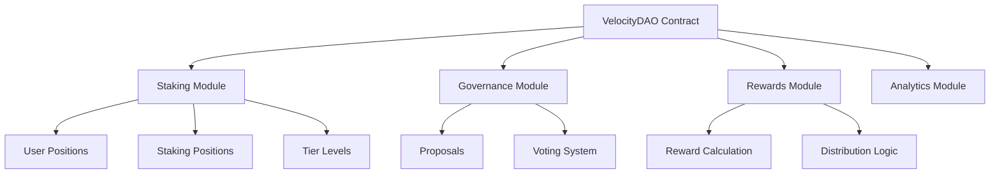

# VelocityDAO Protocol

[](https://opensource.org/licenses/MIT)
[](https://clarity-lang.org/)
[](https://stacks.co/)

## 🚀 Next-Generation Liquid Staking DeFi Protocol

VelocityDAO is an innovative liquid staking protocol that combines Bitcoin's security with Stacks' smart contract capabilities. It enables users to earn yield while maintaining liquidity through tokenized governance and automated reward distribution mechanisms.

## 📋 Table of Contents

- [Features](#-features)
- [Architecture](#-architecture)
- [Getting Started](#-getting-started)
- [Contract Functions](#-contract-functions)
- [Governance](#-governance)
- [Testing](#-testing)
- [Deployment](#-deployment)
- [Security](#-security)
- [Contributing](#-contributing)
- [License](#-license)

## ✨ Features

### Core Protocol Features

- **🔄 Liquid Staking Positions**: Generate continuous yield while maintaining liquidity
- **⏱️ Time-weighted Governance**: Voting power based on stake duration with penalty-free delegation
- **📈 Automated Compound Interest**: Smart contract-driven reward accumulation and distribution
- **🔗 Cross-chain Compatibility**: Bitcoin-native applications with Stacks integration
- **⚡ Dynamic Fee Optimization**: Network condition-based fee adjustments
- **🏛️ Community Treasury**: Transparent allocation and management system

### Advanced Features

- **💧 Instant Liquidity Withdrawal**: Flexible lock periods with customizable terms
- **🎯 Multi-tier Membership**: Enhanced rewards based on stake amounts
- **🗳️ Decentralized Proposals**: Quorum-based execution system
- **🚨 Emergency Safety**: Community override capabilities for critical situations
- **📊 Real-time Analytics**: Performance tracking dashboard integration

## 🏗️ Architecture

### Smart Contract Components



### Token Economics

- **Base Reward Rate**: 5% APY for standard staking
- **Tier-based Multipliers**: Up to 2x rewards for premium tiers
- **Lock Period Bonuses**: Additional 1.5x multiplier for 2-month locks
- **Minimum Stake**: 1,000,000 µSTX (1 STX)

### Tier System

| Tier | Minimum Stake | Reward Multiplier | Features |
|------|---------------|-------------------|----------|
| 1    | 1 STX         | 1.0x             | Basic staking |
| 2    | 5 STX         | 1.5x             | Enhanced rewards, governance |
| 3    | 10 STX        | 2.0x             | Premium features, priority access |

## 🚀 Getting Started

### Prerequisites

- [Clarinet](https://github.com/hirosystems/clarinet) v2.0+
- [Node.js](https://nodejs.org/) v18+
- [Git](https://git-scm.com/)

### Installation

1. **Clone the repository**

   ```bash
   git clone https://github.com/samiat-balogun/VelocityDAO.git
   cd VelocityDAO
   ```

2. **Install dependencies**

   ```bash
   npm install
   ```

3. **Verify installation**

   ```bash
   clarinet check
   ```

4. **Run tests**

   ```bash
   npm test
   ```

### Quick Start

1. **Initialize the contract**

   ```clarity
   (contract-call? .VelocityDAO initialize-contract)
   ```

2. **Stake STX tokens**

   ```clarity
   (contract-call? .VelocityDAO stake-stx u1000000 u0) ;; Stake 1 STX, no lock
   ```

3. **Create a governance proposal**

   ```clarity
   (contract-call? .VelocityDAO create-proposal 
     u"Increase base reward rate to 6%" 
     u1440) ;; 24-hour voting period
   ```

## 📜 Contract Functions

### Public Functions

#### Staking Operations

- `stake-stx(amount: uint, lock-period: uint)` - Stake STX with optional lock period
- `initiate-unstake(amount: uint)` - Begin unstaking process with cooldown
- `complete-unstake()` - Complete unstaking after cooldown period

#### Governance Operations

- `create-proposal(description: string-utf8, voting-period: uint)` - Create governance proposal
- `vote-on-proposal(proposal-id: uint, vote-for: bool)` - Cast vote on proposal

#### Administrative Functions

- `initialize-contract()` - Initialize protocol configuration (owner only)
- `pause-contract()` - Emergency pause functionality (owner only)
- `resume-contract()` - Resume contract operations (owner only)

### Read-Only Functions

- `get-contract-owner()` - Returns contract owner address
- `get-stx-pool()` - Returns total STX pool balance
- `get-proposal-count()` - Returns total number of proposals

### Data Structures

#### UserPositions

```clarity
{
  total-collateral: uint,
  total-debt: uint,
  health-factor: uint,
  last-updated: uint,
  stx-staked: uint,
  analytics-tokens: uint,
  voting-power: uint,
  tier-level: uint,
  rewards-multiplier: uint
}
```

#### StakingPositions

```clarity
{
  amount: uint,
  start-block: uint,
  last-claim: uint,
  lock-period: uint,
  cooldown-start: (optional uint),
  accumulated-rewards: uint
}
```

#### Proposals

```clarity
{
  creator: principal,
  description: (string-utf8 256),
  start-block: uint,
  end-block: uint,
  executed: bool,
  votes-for: uint,
  votes-against: uint,
  minimum-votes: uint
}
```

## 🗳️ Governance

### Proposal Creation Requirements

- Minimum voting power: 1,000,000 µSTX
- Description length: 10-256 characters
- Voting period: 100-2,880 blocks (≈17 minutes to 1 day)

### Voting Mechanism

- Voting power proportional to staked amount
- Time-weighted voting (longer stakes = more power)
- No token lock during voting period
- Proposals require quorum for execution

### Governance Process

1. **Proposal Creation**: Eligible users submit proposals with clear descriptions
2. **Community Review**: 24-48 hour discussion period
3. **Voting Phase**: Active voting within specified timeframe
4. **Execution**: Automatic execution if quorum and majority achieved

## 🧪 Testing

### Test Structure

```
tests/
├── VelocityDAO.test.ts      # Main contract tests
├── staking.test.ts          # Staking functionality tests
├── governance.test.ts       # Governance mechanism tests
└── integration.test.ts      # End-to-end integration tests
```

### Running Tests

```bash
# Run all tests
npm test

# Run with coverage report
npm run test:report

# Watch mode for development
npm run test:watch

# Check contract syntax
clarinet check
```

### Test Coverage

- ✅ Staking operations (stake, unstake, rewards)
- ✅ Governance mechanisms (proposals, voting)
- ✅ Tier system functionality
- ✅ Access control and security measures
- ✅ Edge cases and error handling

## 🚢 Deployment

### Network Configuration

The protocol supports deployment on:

- **Devnet**: Local development and testing
- **Testnet**: Public testing environment
- **Mainnet**: Production deployment

### Deployment Steps

1. **Configure network settings**

   ```bash
   # Edit settings/Devnet.toml, Testnet.toml, or Mainnet.toml
   ```

2. **Deploy contract**

   ```bash
   clarinet deploy --network testnet
   ```

3. **Initialize protocol**

   ```bash
   clarinet run initialize-contract --network testnet
   ```

4. **Verify deployment**

   ```bash
   clarinet call get-contract-owner --network testnet
   ```

## 🔒 Security

### Security Measures

- **Access Control**: Owner-only administrative functions
- **Input Validation**: Comprehensive parameter checking
- **Overflow Protection**: Safe arithmetic operations
- **Emergency Mechanisms**: Pause functionality for critical situations
- **Cooldown Periods**: Prevention of rapid stake/unstake cycles

### Audit Status

- [ ] Internal security review
- [ ] External audit (planned)
- [ ] Bug bounty program (planned)

### Known Limitations

- Contract owner has significant control (emergency functions)
- Cooldown periods may limit liquidity in some scenarios
- Governance requires minimum participation threshold

## 🤝 Contributing

We welcome contributions from the community! Please follow these guidelines:

### Development Workflow

1. **Fork the repository**
2. **Create a feature branch**

   ```bash
   git checkout -b feature/your-feature-name
   ```

3. **Make your changes**
4. **Add tests for new functionality**
5. **Run the test suite**

   ```bash
   npm test
   ```

6. **Submit a pull request**

### Code Standards

- Follow Clarity best practices
- Include comprehensive tests
- Document all public functions
- Use clear, descriptive variable names
- Add comments for complex logic

### Issue Reporting

Please use GitHub Issues to report:

- Bugs and unexpected behavior
- Feature requests
- Documentation improvements
- Security concerns (use private disclosure)

## 📄 License

This project is licensed under the MIT License - see the [LICENSE](LICENSE) file for details.
## 🙏 Acknowledgments

- Stacks Foundation for blockchain infrastructure
- Hiro Systems for development tools
- Community contributors and testers
- Security researchers and auditors
